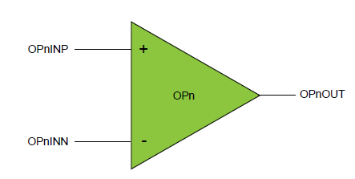

# Getting started with Mindi® simulation and PIC18-Q41 microcontrollers
This guide will get you up and running with simulating the analog OPAMP module in PIC18-Q41 family devices using the Mindi simulation tool. **For more information about getting started with and using the MPLAB Mindi Analog Simulator please refer to the following resources:**
- [Microchip Developer - Introduction to MPLAB Mindi Analog Simulator](https://microchipdeveloper.com/mindi:mindi-analog-simulator-introduction)
- [Getting Started with the MPLAB Mindi Analog Simulator Document](http://ww1.microchip.com/downloads/en/DeviceDoc/Getting-Started-MPLAB-Mindi-Analog-Simulator-DS50002564B.pdf)

## Configuration: Connected Directly to Pins
This configuration connects the bare op-amp directly to the pins, allowing any standard op-amp configuration to be achieved by connecting the appropriate external components

### Mindi Simulation

Download and open the **Mindi schematic [here](schematics/)**. Press the _play_ button to simulate with an example stimulus source. Note that the un-connected op-amp example is provided without any standard external circuitry.

### Don't have Mindi?
Download and install [Mindi simulation tool](https://www.microchip.com/mplab/mplab-mindi) here.
